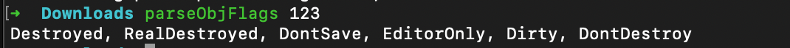

# parseObjFlags

When running the cocos creator project, I often want to know a cocos object. Unfortunately, _objFlagId has no integer and I cannot visually see the status of this object. In order to solve this problem, the parseObjFlags tool was developed.

## Install

```bash
npm i parse-objflags -g
```

## Usage

1. Execute in the console
```bash
parseObjFlags <id>
```

## Example
